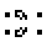

# Next Level Game of Life
This repository contains a performance engineering overview for a Conway's Game of Life implementation, where performance is pushed to the maximum.

*[34p14 shuttle](https://conwaylife.com/wiki/34P14_shuttle)*

## Optimizations
The project contains the following optimizations build incrementally on top the reference implementation (v0):
 - Optimized datastructure for GIF encoding after changing to `uint_8_t` (v1) and updating the border code (v2).
 - Removed excessive looping in GIF encoding (v3).
 - Optimized indexing in world step generation (v4).
 - Parallelization using OpenMP (v5.0) and PThreads (v6.0).
 - Different way to write the GIF files using *mmap* (v5.1 and v6.1).
 - Instruction level parallelization using SIMD (v7.0 and v7.1)

You can find all implementations in the `apps` directory.

## Acknowledgements
The inital code was based on the assignment from the
[Parallel Programing Practical course](https://studiegids.vu.nl/en/Master/2021-2022/computer-science-joint-degree/X_400162/)
at the Vrije Universiteit in Amsterdam, the Netherlands, and the
[CS2110 course](https://web.cs.dal.ca/~arc/teaching/CS4125/2014winter/Assignment2/Assignment2.html) at Dalhousie
University in Halifax, NS, Canada.
